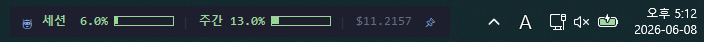
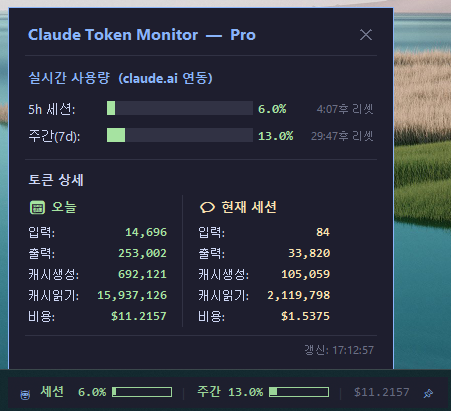

# Claude Token Monitor

[](LICENSE)

🇺🇸 [English](README.md) | 🇰🇷 한국어

Claude Code 사용자를 위한 실시간 토큰 사용량 모니터링 플로팅 바.

## 스크린샷

**플로팅 바**



**상세 팝업** (바를 더블클릭)



## 기능

- **실시간 사용량 %** — claude.ai 계정과 직접 연동, 실제 사용량 반영
- **5시간 세션 사용량** — 현재 세션의 사용량 및 리셋까지 남은 시간
- **주간 사용량** — 이번 주 누적 사용량 및 리셋까지 남은 시간
- **게이지 바** — 색상으로 경고 (70% 이상 노란색, 90% 이상 빨간색)
- **오늘 토큰 상세** — 입력/출력/캐시 토큰 수 및 예상 비용
- **항상 위에 고정** — 핀 버튼(📌)으로 토글
- **드래그 이동** — 원하는 위치로 자유롭게 이동
- **다국어 지원** — 한국어 / English 전환

## 요구사항

- Windows 10/11
- **Claude Code 설치 및 로그인 필수**
  - Claude Code 로그인 시 자동 생성되는 `~/.claude/.credentials.json` 을 사용해 인증

## 설치 및 실행

### 배포 버전 (exe) — 권장

1. [Releases](https://github.com/TIONBARY/token-monitor/releases/latest) 에서 `ClaudeTokenMonitor.exe` 다운로드
2. 실행

Python이나 별도 설치 없이 바로 실행 가능.
Windows Defender 경고가 뜨면 **추가 정보 → 실행** 클릭.

### 소스 실행

```bash
pip install -r requirements.txt
python main.py
```

## 사용법

| 동작 | 기능 |
|------|------|
| 더블클릭 | 상세 팝업 열기/닫기 |
| 우클릭 | 메뉴 (상세 보기 / 언어 설정 / 종료) |
| 드래그 | 위치 이동 |
| 📌 클릭 | 항상 위 고정 토글 |

### 언어 설정

우클릭 → 언어 설정에서 한국어 / English 선택 가능. 설정은 `config.json`에 저장되어 다음 실행 시에도 유지됨.

## 동작 원리

Claude Code 로그인 시 생성되는 OAuth 토큰(`~/.claude/.credentials.json`)을 읽어 `claude.ai/api/oauth/usage` API를 호출. Claude Code의 로그인 세션을 공유하는 방식으로 별도 로그인 불필요.

- API 사용량: 1분마다 갱신
- 토큰 상세(JSONL): 5초마다 갱신
- 리셋 카운트다운: 5초마다 갱신

## 플랫폼 지원

| OS | 상태 |
|----|------|
| Windows 10/11 | ✅ 지원 |
| macOS | ❓ 미테스트 — 기여 환영! |
| Linux | ❓ 미테스트 — 기여 환영! |

macOS / Linux 포팅에 관심 있으신 분은 [Issues](https://github.com/TIONBARY/token-monitor/issues)에서 논의해 주세요.

## ⚠️ 주의사항

이 프로그램은 **Anthropic의 비공식 내부 API** (`claude.ai/api/oauth/usage`)를 사용합니다.

- 공식적으로 공개된 API가 아니므로 **Anthropic이 언제든 변경하거나 차단할 수 있습니다**
- Anthropic의 서비스 이용약관에 명시되지 않은 방식의 API 접근일 수 있습니다
- 이로 인해 발생하는 문제에 대해 책임지지 않습니다

## 빌드

```bash
pip install pyinstaller
pyinstaller --onefile --windowed --name "ClaudeTokenMonitor" main.py
# dist/ClaudeTokenMonitor.exe 생성
```
